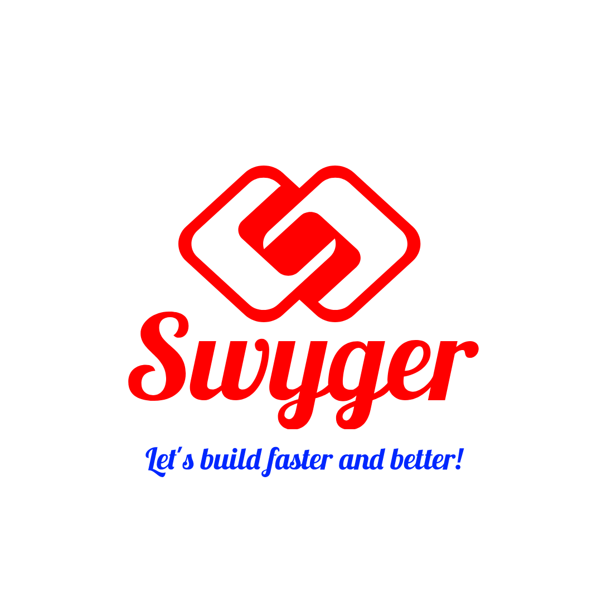

# Swyger

**Swyger** is best for all your projects.It has everything to get started!
Swyger is a boilerplate made for you to get started with Server and Client Side.

Actually the available Projects are:
- Server:
   - NodeJS: https://github.com/coorise/swyger/tree/master/server/node-js or Master Branch: https://github.com/coorise/swyger-nodejs-server.git
- Client: 
  - Js: https://github.com/coorise/swyger/tree/master/client/js/all or Master Branch: https://github.com/coorise/swyger-js-client.git

# Todo
- Removing/Reduce some unusual dependencies,functions, refactoring paths/files...
- Making good and easy documentation with tutorials (videos, webpage...)
- Code Cleaning/ Making a suitable project structure with modulable pattern
- Making Docker file for the whole project (auth,base,database,storage...)
- Refactoring code in Php(like Laravel pattern), Java, ...etc

# Join US
If you have any suggestion, feature to add ...etc
- Discord(Support Team, FAQ, Chat): https://discord.gg/PPTZY5qFdC

# Contributors
- Agglomy Team :
  - Ivan Joel Sobgui
# Licence

MIT: You can use it for educational/personal/business purpose!