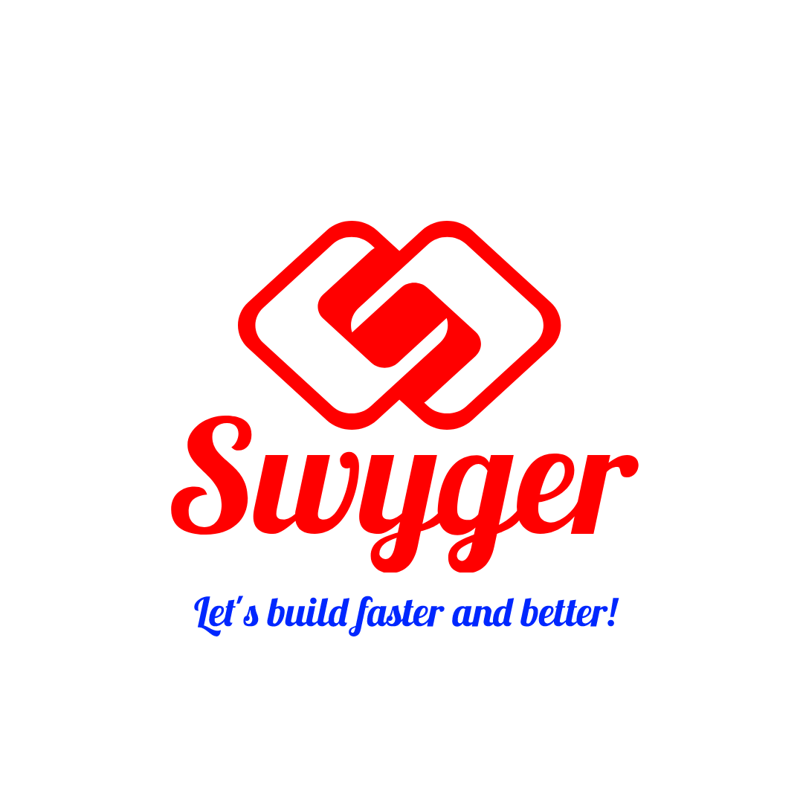

#  Swyger CLI

**Swyger CLI(Command Line Interface)** is created to help you to generate the boilerplate project (server/client...)

So it is a free and open source!!!

## Prerequisite:
- NodeJS 16+: https://nodejs.org/
- Browser: Google Chrome, Firefox, Microsoft Edge...etc (latest version)
- Terminal(command line to run the app for test)
- IDE( to modify the code source): Visual Studio, PhpStorm(recommended),sublimetext 4...etc

## Note:
This Framework, assume you already know how to use NodeJS.

## Installing Swyger CLI

``npm i @swyger/cli`` from a project

or globally ``npm i -g @swyger/client``

## Common Commands:

- ``swyger -h``: To get the commands and option
- ``swyger init``: To init the project
  - ``init`` command can be directly chained with:
    - ``-n your-project-name``: To create the project name

Note: In case you don't know the options, just type ``swyger-cli init`` and follow the scripts.

## References

- @clack/prompts: https://github.com/natemoo-re/clack
- yargs: https://www.npmjs.com/package/yargs

# Join US
If you have any suggestion, feature to add ...etc
- Discord(Support Team, FAQ, Chat): https://discord.gg/PPTZY5qFdC

# Contributors
- Agglomy Team :
  - Ivan Joel Sobgui
# Licence

MIT: You can use it for educational/personal/business purpose!
