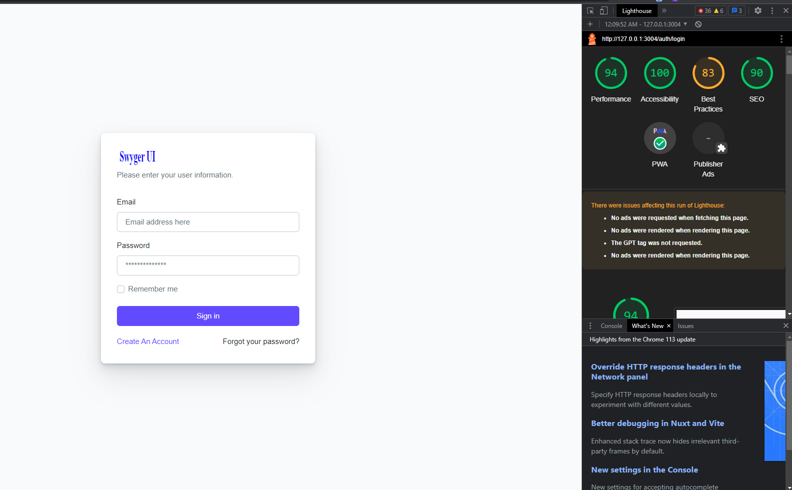

#  <span style="color: red;">Swyger</span> <span style="color: blue;">SPA</span>


**Swyger SPA(single page Application)** is the best static html boilerplate to get started with your static frontend website!


So it is a free and open source JavaScript library based on Petite-vue.js, Node.js, Vite and Babel.js. Swyger SPA is inspired by Nuxt.js/Next.js/Angular, which is a framework of similar purpose. The framework is advertised as a "Meta-framework for universal applications"

Note:Look for rollup option in **vite.config.js**

## Prerequisite:
- NodeJS 16+: https://nodejs.org/
- Browser: Google Chrome, Firefox, Microsoft Edge...etc (latest version)
- Terminal(command line to run the app for test)
- IDE( to modify the code source): Visual Studio, PhpStorm(recommended),sublimetext 4...etc


## Note:
This Framework, assume you already know how to use NodeJS and ViteJS(Look for reference links at the bottom of this page)

Please keep the following **Folder Structure** so that `Vite JS` will build it with ease:

- ## **`index.html`**
(let it at the root of the project)
- ## **`src`**
(everything in src will be parsed,bundled to dist)
- ## **`static`**
(everything in static will be simply copied to dist. Also in won't auto reload the modified files during dev mode, so you have to refresh your browser manually)

- ## **`src/index.js`**
(the main entry of app )
- ## **`src/route.js`**
(the route file of app )

- ## **`src/app/*`**
(files of app like BaseController, Service, Middlewares...etc )

- ## **`src/resources/vendors/petite-vue/*`**
(the petite-vue vendor )
- ## **`static/component.html`**
(jquery will use it to load vue live data with child component )

- ## **`src/resources/vendors/vendors/spa-router-better/*`**
(this vendor used for route of your app )

- ## **`static/public/assets/js/*`**
(global variables  )

- ## **`replace-src.js`**
(with auto replace in index.html tags (href,src...) the ='./src/' to ='./' for build )

Note: You can modify everything according to your need from scratch (dir,path,files...ect), just be careful of
what you are doing when modifying those files :)

## Swyger Route
We also have integrated swyger route,<br>
check ``src/route.js`` and to use the api client, check some examples  <br>
on: ``src/app/rest/api/name_of-api/controllers/pages/name_of_controller``<br>
```
const {req,controller}=args;
  //console.log('path : ', req.path)
  //console.log('query : ', req.query)
  //console.log('param : ', req.param)
  const router=req.$router
  //router?.go('/')
  //router.back('path')
  //router.mount('path',function)
  //router.off('path')
  //router.reload()
```

## Important:
for your static and dynamic import like (**href,src, import,...etc**)

  - **``./``** means ``src`` folder

```
<head>
...
  <link href="./name-of-your-asset.scss" rel="preload stylesheet" as="style" type="text/css" crossorigin="anonymous"/>
</head>
<body>
 ...
 <script type="module" src="./name-of-your-asset.js"></script>
</body>
```

Note:if you add **<'script src='file'></script'> tags** you have to add **type="module"**, else it won't copy it to dist, you have to add your script to static folder '/' instead.

  - **``/``** means ``static`` folder
```
<head>
...
  <link href="/name-of-your-asset.scss" rel="preload stylesheet" as="style" type="text/css" crossorigin="anonymous"/>
</head>
<body>
 ...
 <script src="/name-of-your-asset.js"></script>
</body>
```

Note:For public assets (static), adding in **<'script></script'> tags** is not required to add type="module".

( good when you want to import global variables for the whole app, like jquery,...etc).

If you have not installed dependencies from **`/package.json`**

``npm i``

For dev environment:

 ``npm run dev``

There is two methods for build:

 ``npm run build`` with minify,

 ``npm run build:dev`` without minify

For production environment:

``npm run start
``

## `Attention!`

For <span style="color: blue;font-size:20px">***full static project*** </span>, <span style="color: red;font-size:40px">***don't use*** </span>    [<span style="color: green;font-size:30px"> **NodeJs native modules**</span>]  like (**path, fs, ...etc**),
it will <span style="color: red;">throw errors on your browser !!!</span>


Also if  <span style="color: red;">some "modules" couldn't be fetched</span>
<span style="color: yellow;">***automatically during the build*** </span> or it got the wrong production file,
<span style="color: blue;font-size:20px">***you have to import the files manually from 'node_modules/package_name/dist...' !!!*** </span>.
You can put it in **static/public/vendors/[name-of-module]**.

Once building is finished, care to modify the **"dist/index.html'**,
there, every import link (href,src,...)
In "dist" folder tags beginning with **'./src' replace it to './'**(only in case the replace-src.js did not catch it automatically)

## Tips
To improve your app speed during <span style="color: yellow;font-size:20px">***Production*** </span>, try to use some preloads, like:
- CSS
```
<head>
...
  <link href="name-of-your-asset.css" rel="preload stylesheet" as="style" type="text/css" crossorigin="anonymous"/>
</head>
```
- JS

  adding "defer" attribute will respect the oder of script files
```
<head>
...
  <script defer src="name-of-your-asset.js"></script>
</head>
```
or put the script at
the bottom of the end of <'/body> tag
```
<body>
...
  <script src="name-of-your-asset.js"></script>
</body>
```
- Assets(.img,.svg,.mp4, ...etc)

you could compress it using **gzip**(gzip) or **brotli**(br),
then tell your server to use it,

```
<head>
...
<meta name="Content-Encoding" content="br,gzip">
<meta name="Accept-Encoding" content="br,gzip">
</head>
<body>
...
  <script src="name-of-your-asset.js.gzip"></script>
  <script src="name-of-your-asset-2.js.br"></script>
</body>
```

## Template
You will see template (we customized it to feel something like wordpress)
**`/static/public/themes/`**
- default : build your own template following the project structure
- dashui: https://dashui.codescandy.com/

Note: you can switch dynamically by extending the <span style="color: yellow;font-size:15px">***BaseController.theme="name_of_folder"*** </span>

from: **`src/app/helpers/common/controllers/base.controller.js`**

## Preview


As you can see we have a good score with lighthouse from Google Chrome Dev console!!!


## References

- Vite Config: https://vitejs.dev/config/
- RollupOption: https://rollupjs.org/guide/en/#big-list-of-options
- Petite-Vue: https://www.npmjs.com/package/petite-vue
- SPA-Router-Better: https://github.com/zcoding/spa-router
- SEO-META: https://www.npmjs.com/package/head-manager
- IFrame Api: https://developer.mozilla.org/en-US/docs/Web/HTML/Element/iframe

# Join US
If you have any suggestion, feature to add ...etc
- Discord(Support Team, FAQ, Chat): https://discord.gg/PPTZY5qFdC

# Contributors
- Agglomy Team :
  - Ivan Joel Sobgui
# Licence

MIT: You can use it for educational/personal/business purpose!
